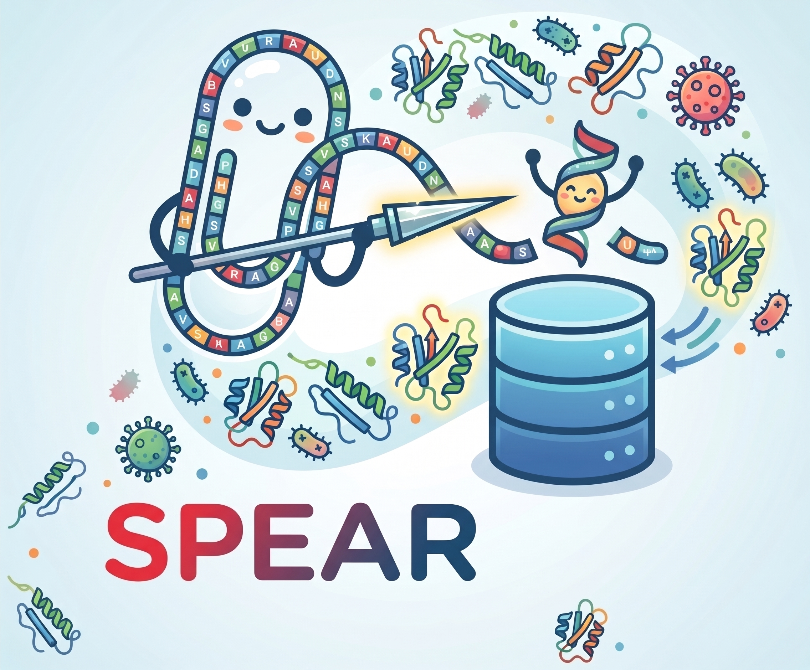

# Project SPEAR: 

## Segmentation of Peptides for Encrypted Antimicrobial Revelation 

Goal: To train a model to automatically cleave peptides strategically to reveal antimicrobial peptides encrypted inside them (cryptomics mining for antimicrobial peptides).

